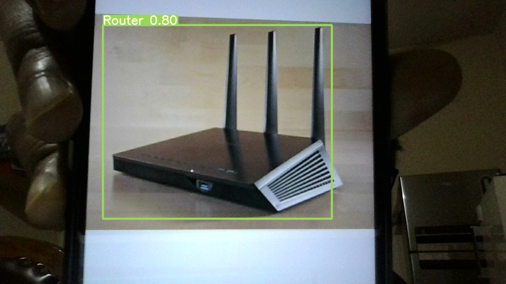
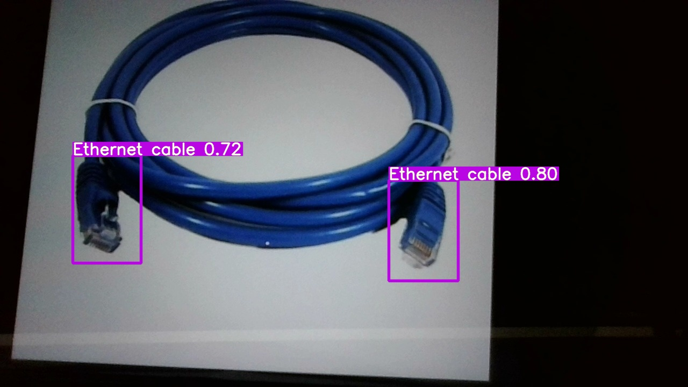
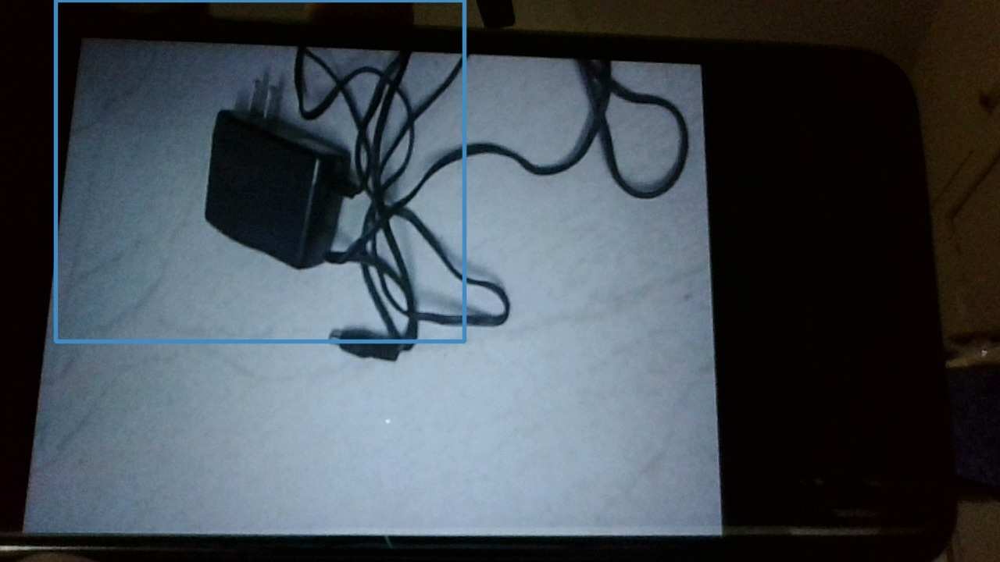
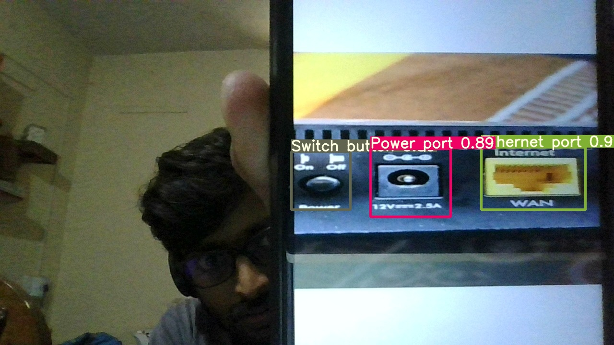

                            +-++-++-++-++-++-++-++-++-++-++-++-++-++-++-++-++-++-++-++-++-++-+
                            |o||b||j||e||c||t||-||d||e||t||e||c||t||i||o||n||-||m||o||d||e||l|
                            +-++-++-++-++-++-++-++-++-++-++-++-++-++-++-++-++-++-++-++-++-++-+


# Problem statement
Develop a computer vision model for detecting router

<div align="center">  </div>

# Minimum hardware requirement for development and production
- Operating System (local): Window 10
- Operating System (Server): Window 2012 R2 with required setup mentioned below (require admin permission and system restart)

1. Window server media essentials features (Basic requirement for opencv-python package) [Download driver](https://www.microsoft.com/en-us/download/details.aspx?id=40837)
2. Microsoft Visual C++ 2015-2019 Redistributable (Basic requirement for Pytorch) [Download link](https://support.microsoft.com/en-us/topic/the-latest-supported-visual-c-downloads-2647da03-1eea-4433-9aff-95f26a218cc0)
  
- Random Access Memory (RAM): 8 GB 
- Central Processing unit (CPU): 4 core and 8 logical processor

# Instruction to install the application in local machine
1. Install Anaconda from this link https://www.anaconda.com/products/individual#windows and follow the steps mentioned in following link
https://docs.anaconda.com/anaconda/install/windows/

2. After Anaconda installation, go to search and run Anaconda Prompt and create virtual environment using following commands.

    `conda create -n visualbot python=3.7.3 anaconda`

    `conda activate visualbot`

3. Run Anaconda prompt and change the drive to the location to this directory and run command `python -m pip install -r requirements.txt`. This will install all the packages require for model execution.

4. To check the performance of the trained model, run the command `python -m tensorboard.main --logdir runs` in anaconda prompt at this file location. Hit `http://localhost:6006/` on browser to visualize the performance.
   
# Technology used
- Python 3.7.3
- Computer vision
- Pytorch
- [**YOLO**](https://github.com/ultralytics/yolov5)
- [**labelImg**](https://github.com/tzutalin/labelImg)
- [**webrtc**](https://webrtchacks.com/webrtc-cv-tensorflow/)

# How to train the model?
- Upload the dataset in google drive
- Go to `./src/` folder
- Modify [trainerMetadata.yaml](./src/trainerMetadata.yaml)
- Run [objectDetection.ipynb](./src/objectDetection.ipynb) file

**Train on Google colab**: <a href="https://colab.research.google.com/github/ashishkrb7/Object-detection-model/blob/master/src/ObjectDetection.ipynb"></a>

# Sample JSON output of the API
```json
[{\"height\": \"0.855\", \"width\": \"0.9\", \"y\": \"0.0\", \"x\": \"0.08375\", \"score\": \"0.88620275\", \"class_name\": \"Router\", \"name\": \"Router Identified.\"}, {\"threshold\": 0.7, \"name\": \"CSS Corp Visual bot\", \"numObjects\": \"1\"}]
```
# Sample outputs
| | |
|---|---|
|||
|||

# License
[](https://github.com/ashishkrb7/Object-detection-model/blob/master/LICENSE)
```
Copyright (c) 2021 Ashish Kumar
```

# Author
Ashish Kumar

[](https://www.linkedin.com/in/ashishk766/) 
[](mailto:ashish.krb7@gmail.com) 

Made with ❤️ in India

## Contributors

<a href="https://github.com/ashishkrb7/Object-detection-model/graphs/contributors">
  
</a>

# References
- [YOLO V1 paper 2015](./docs/1506.02640.pdf)

- [YOLO V2 paper 2016](./docs/1612.08242v1.pdf)

- [YOLO V3 paper 2018](./docs/1804.02767.pdf)

- [YOLO V4 paper 2020](./docs/2004.10934.pdf)

- [**YOLO V5**](https://github.com/ultralytics/yolov5)
